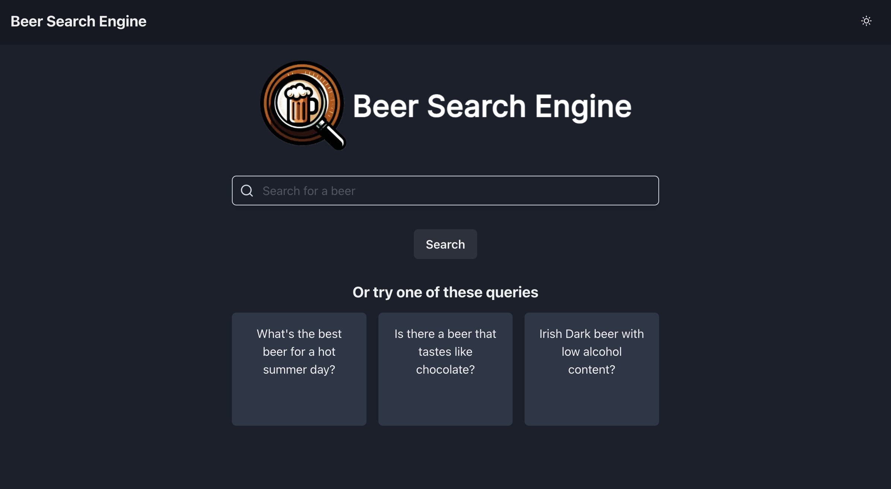
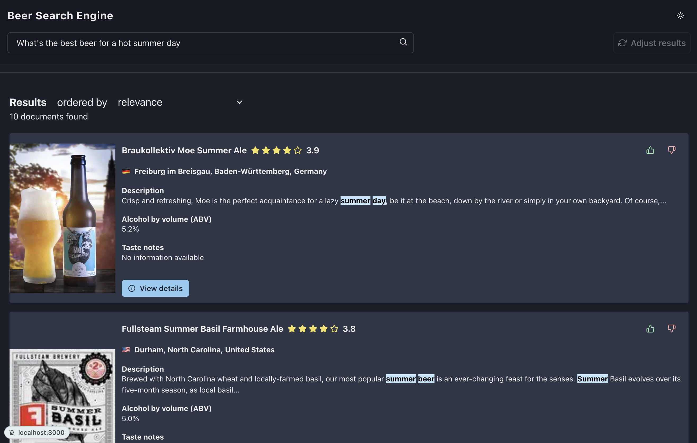
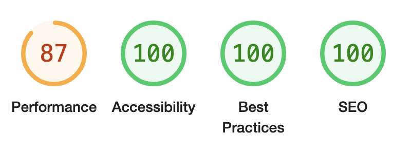
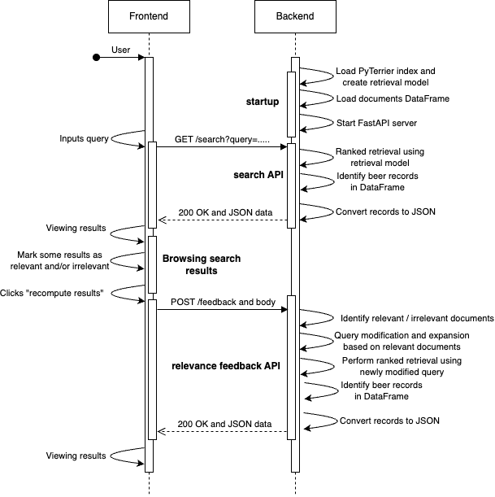

# Beer Search Engine<!-- omit in toc -->

<p align="center">
	<picture>
		<source media="(prefers-color-scheme: dark)" srcset="./extra/logo/logo-dark-mode.png">
		<source media="(prefers-color-scheme: light)" srcset="./extra/logo/logo-light-mode.png">
		
	</picture>
</p>

Welcome to our unique project, a sophisticated information retrieval system specifically designed for beer enthusiasts! This project is not just about finding a beer, it's about discovering the perfect brew that matches your taste and mood.

Our system leverages the power of [PyTerrier](https://github.com/terrier-org/pyterrier) for information retrieval and [FastAPI](https://github.com/tiangolo/fastapi) for creating a fast, robust, and easy-to-use RESTful API. The results? You get to query the index and retrieve results in a convenient JSON format.

But that's not all! We've also developed a responsive web interface using [NextJS](https://github.com/vercel/next.js) and [React.js](https://github.com/facebook/react). This means you can interact with our search engine in a user-friendly and effective way, right from your browser.

Our system is designed to answer intuitive queries like:

- *What's the best beer for a hot summer day?*
- *Is there a beer that tastes like chocolate?*
- *Irish dark beer with low alcohol content*

So, whether you're a beer connoisseur or a casual drinker, our project is here to transform the way you discover and enjoy beer. Cheers to that! 🍻

## Table of Contents<!-- omit in toc -->

- [1. Getting started](#1-getting-started)
- [2. Project requirements](#2-project-requirements)
- [3. Dataset construction and crawling](#3-dataset-construction-and-crawling)
  - [3.1. Data structure and storage](#31-data-structure-and-storage)
  - [3.2. Data scraping](#32-data-scraping)
    - [3.2.1. WineVybe spider](#321-winevybe-spider)
    - [3.2.2. RateBeer spider](#322-ratebeer-spider)
    - [3.2.3. BeerMe spider](#323-beerme-spider)
- [4. Indexing](#4-indexing)
- [5. System architecture](#5-system-architecture)
  - [5.1. Backend](#51-backend)
    - [5.1.1. Endpoints](#511-endpoints)
    - [5.1.2. Commands](#512-commands)
  - [5.2. Frontend](#52-frontend)
    - [5.2.1. Lighthouse benchmark](#521-lighthouse-benchmark)
  - [5.3. Flow of execution](#53-flow-of-execution)
- [6. Evaluation](#6-evaluation)
  - [6.1. Evaluation design and methodology](#61-evaluation-design-and-methodology)
  - [6.2. System Usability Scale (SUS) questionnaire](#62-system-usability-scale-sus-questionnaire)
  - [6.3. User Experience (UX) questionnaire](#63-user-experience-ux-questionnaire)
  - [6.4. Outcomes](#64-outcomes)

## 1. Getting started

To get started with the project, a tutorial is available [here](./extra/docs/getting-started.md).

## 2. Project requirements

- [Python 3.8](https://www.python.org/) or higher
- [Anaconda](https://www.anaconda.com/) or [Miniconda](https://docs.conda.io/en/latest/miniconda.html) (recommended)
- [GNU Make](https://www.gnu.org/software/make/)
- [Docker](https://www.docker.com/) and [Docker Compose](https://docs.docker.com/compose/) (optional)
- [Bun v1](https://bun.sh/) or higher
- [Java 11](https://www.oracle.com/java/technologies/javase-jdk11-downloads.html)

## 3. Dataset construction and crawling

To ensure a complete and diverse dataset, we selected carefully websites for scraping based on their content richness and scraping feasibility. We evaluated several data sources, but we decided to opt for websites with comprehensive beer information. The selection criteria for the data sources was based on the following key aspects:

1. **Content structure**: Assessing the ease of scraping the data from the website, for both dynamic and static content loading. 

2. **Data quality and availability**: Evaluating the quality and detail of the provided data, aiming for a rich dataset with a wide variety of beer styles and information.

Among all the candidates, we have selected the following three websites as data sources:

- [WineVybe](https://www.winevybe.com/beer/): offers a wide variety of beers, including names, descriptions, types, prices, tasting notes, images, closure and packaging details. The website is built using WordPress, which makes it easy to scrape.

- [RateBeer](https://www.ratebeer.com/): hosts over 100’000 unique beers with well-written descriptions, taste notes, alcohol by volume (ABV%), price, packaging, critic score, and brewer information. The content is loaded dynamically via APIs, which requires more advanced scraping techniques.

- [BeerMe](https://beerme.com/index.php): Contains around 11’000 beer records, detailing brewer information, beer names, styles, scores and production dates. This website is the easiest to scrape, as it is built using static HTML pages with tabular data.

Initially, other websites such as ([BeerAdvocate](https://www.beeradvocate.com/) and [Untappd](https://untappd.com/)) were considered, but they were discarded due to challenges in scraping dynamically loaded content and authentication requirements

### 3.1. Data structure and storage

The data for the information retrieval system is stored in a JSONL file (JSON Lines), where each line is a JSON object representing a distinct beer. We chose JSONL for suitability in handling record-by-record data processing, which is the
exact use case for our system. Each JSON object follows a consistent structure to ensure consistency across all the records. The fields of the JSON object are the following:

- `docno`: A unique beer identifier.
- `name`: The name of the beer.
- `description`: A detailed description of the beer.
- `image_url`: URL to an image of the beer.
- `price`: An object containing the price details of the beer, which includes:
  - `amount`: The numerical value of the price.
  - `currency`: The currency in which the price is expressed.
- `style`: The style or category of the beer (e.g., lager, ale).
- `critic_score`: An object representing the scores given by critics, which includes:
  - `max`: The maximum possible score that can be given.
  - `actual`:The actual score received to the beer
- `brewer`: An object representing information about the brewer, which includes:
  - `name`: The name of the brewer.
  - `city`: The city where the brewer is located.
  - `country`: An object containing the country details, which includes:
    - `code`: The country code (e.g., CH, US).
    - `name`: The name of the country.
  - `state`: An object containing the state details, which includes:
    - `name`: The name of the state.
- `alcohol_bv`: The alcohol by volume percentage in the beer.
- `tasting_notes`: Notes regarding the taste and flavor profile of the beer.
- `closure`: Information about the type of closure used for the beer packaging (e.g., cork, screw cap).
- `packaging`: The type of packaging used for the beer (e.g., bottle, can).

Having a uniform structure for all the records simplifies the representation of the results in the web interface, as it eliminates the need to parse the data using different techniques depending on the website.

### 3.2. Data scraping

The data scraping process leverages Scrapy framework, a robust Python library for creating web crawlers in a straightforward manner. For each of the three selected websites (refer to section 1), we have created a dedicated spider tailored to the website structure and data presentation format.

This approach enabled us to efficiently extract over 50’000 beer records from the three websites. The following sections provide a brief overview of the scraping process for each of the three websites.

#### 3.2.1. WineVybe spider

The [WineVybe](https://winevybe.com/) spider scrapes the website beer gallery powered by the WooCommerce plugin for WordPress. The website posed some additional scraping challenges since the data structure is not consistent across all pages. However, the data is generally clean, and for most of the beers, we have all the fields we need, including the image URL and a varied-length description. Unfortunately, due to the Cross-Origin Resource Sharing (CORS) policies enforced by the CDN that hosts the website images, we cannot access the images directly from the browser.

We opted to not download the images to our server to respect the CDN policies and avoiding wasting resources. Instead, we left the image URL as is, and we instruct the web interface to show a placeholder image instead if the actual image is not available.

#### 3.2.2. RateBeer spider

The [RateBeer](https://www.ratebeer.com/) spider was developed using a different approach than the other two spiders. Since the website dynamically
loads the content via APIs, we could not use the standard scraping techniques. To address this issue, we have reverse-engineered the API endpoints to load the data in the same way the website does, a technique referred in the official documentation of Scrapy (learn more [here](https://docs.scrapy.org/en/latest/topics/dynamic-content.html)). Thanks to tailored requests to the API endpoint that loads the beer library given a query and a page number, we have been able to extract over 12’000 beer records. Thanks to the notoriety of this website, we have been able to collect high-quality data, including detailed descriptions, critic scores, tasting notes, and more.

#### 3.2.3. BeerMe spider

The [BeerMe](https://beerme.com/beerlist.php) spider was scraped thanks to the usage of dynamic scraping. The website proposes a selection of more than 31'000 breweries, some of which were closed and some of which are still active. Each brewery page then contains the list of produced beers. There were some troubles due to the way the data was loaded. The structure and content are not consistent and change for every beer, with fields present in some beers and not in others and vice versa. Thus, to be able to load these fields when present, we used dynamic xpath to scrape them. Instead, placeholders' null values were used for missing fields to align to a common beer structure with other spiders. 

Another problem arose when scraping these pages, as the content is loaded dynamically. Thus, to overcome this issue, we opted for the usage of [SplashRequest](https://github.com/scrapy-plugins/scrapy-splash#requests) to be able to load the content only after some seconds. This still did not completely fix the issue, but still allowed us to scrape most of the beers, Although it was not possible to retrieve all of the 62'000 beer records, more than 45'000 beers were retrieved, thus a sufficient amount for our engine.

## 4. Indexing

To build the index based on the collected data, we used the PyTerrier library, which is a Python library for the Terrier IR platform. The library provides a set of tools to build and evaluate IR systems, and it’s built on top of the Terrier platform, which is a Java-based open-source IR platform. After the completion of the crawling of the data, we realized we needed a set of strings to be able to create an index,
which we did not have yet ready for index creation as our dataset was composed of JSON objects.

Our decision was thus to move on to put together all the data for each record into a single string by recursively taking
all the values of the various fields and concatenating them with a blank space in between. We decided to go with this
structure as indexers usually have to deal with plain text, and thus it’s reasonable to unify the data in this way as that’s how data would usually look after scraping them.

After this step, we moved on the actual index creation. To address this task, we leveraged the `IterDictIndexer` class,
which allows to build an index from a dictionary of textual documents. The index has been built using the following
settings:

- *Retrieval model*: BM25
- *Stemmer*: Porter stemmer. This stemmer is based on the original Porter stemmer algorithm, which is a widely
used stemmer for the English language
- *Stopwords*: PyTerrier default stopwords for English language.
- *Tokeniser*: PyTerrier default tokeniser for English language.

## 5. System architecture

In this section outlines the implementation of the beer information retrieval system, focusing on the key components and technologies used to its development.

The system is composed of two main components: the backend and the frontend. In the following subsections both components will be described in detail to provide a better understanding of the inner workings of the search engine.

### 5.1. Backend

The backend is the core of the entire information retrieval system as it is responsible for the business logic. It offers two main functions: dataset indexing leveraging [PyTerrier](https://github.com/terrier-org/pyterrier), and REST APIs to query the index and retrieve the results in JSON format and to perform relevance feedback.

It has been built using [Python](https://www.python.org/) and [FastAPI](https://github.com/tiangolo/fastapi), a modern, fast (high-performance), web framework for building APIs. This particular framework has been chosen as it is easy to use, is well documented and allows building APIs in a matter of minutes.

#### 5.1.1. Endpoints

As already cited in the previous section, the backend offers two endpoints to interact with the index. Both endpoints
are REST APIs and are described in detail in the following list:

1. `/search` is the endpoint used to perform a query to the index. It accepts a GET request with the following query
parameters:
     - `query`: The query to be performed to the index.
     - `top`: The number of results to be returned.

  Example of a request to the `/search` endpoint:

  ```bash
  curl -X 'GET' \
    'http://localhost:8000/search?query=ipa&top=10' \
    -H 'accept: application/json'
  ```

2. `/feedback` is the endpoint used to perform relevance feedback. It accepts a POST request with the following
body parameters:

    - `query`: The query to be performed to the index.
    - `relevant`: The list of document IDs that the user considers relevant.
    - `irrelevant`: The list of document IDs that the user considers irrelevant
    - `top`: The number of results to be returned.

  Example of a request to the `/feedback` endpoint:

  ```bash
  curl -X 'POST' \
    'http://localhost:8000/feedback?top=10' \
    -H 'accept: application/json' \
    -H 'Content-Type: application/json' \
    -d '{
      "query": "ipa",
      "relevant": [
        "d1",
        "d2"
      ],
      "irrelevant": [
        "d3",
        "d4"
      ]
    }'
  ```

*FastAPI* automatically generates the documentation of the endpoints, which can be accessed at <http://localhost:8000/docs>. From this page it is possible to interact with the endpoints and test them in real-time directly from the browser.

#### 5.1.2. Commands

To simplify the execution of the backend, a Makefile is provided to allow the user to easily build the index and start the REST API server. The following commands are available:

- `make build-index`: builds the reverse index from the dataset crawled from the web and stored in the `data` folder.
- `make dev`: starts the backend in development mode, which means that the server will automatically restart when
a change in the code is detected.
- `make start`: starts the backend in production mode. This mode is recommended when deploying the backend to a production environment.

### 5.2. Frontend

The frontend, designed carefully to provide a good user experience across all devices, is the component that enable users to interact with the search engine. It is a web application that allows users to perform a search and visualize the results of the query in a user-friendly way. Additionally, it allows users to perform relevance feedback to improve the results of the query.

The webapp has been built using advanced web technologies to provide a modern and fast application that respect
modern web standards. The following technologies have been used to build the frontend:

- [TypeScript](https://www.typescriptlang.org/) is a programming language developed by Microsoft. It is a superset of JavaScript that adds static typing to the language. It is a very powerful language that allows to build complex web applications.

- [NextJS](https://nextjs.org/) is a framework built on top of React.js that allows to build server-side rendered web applications. It is a very powerful framework that allows to build web applications in a matter of minutes.

- [React.js](https://reactjs.org/) is a JavaScript library for building user interfaces. It is a very popular library that is used by many companies to build their web applications.

- [Chakra UI](https://chakra-ui.com/) is a component library that provides a set of accessible and reusable components that can be used to build user interfaces.

The frontend is composed of two main pages: a homepage that allows the user to perform an initial search, and a search page that allows the user to visualize, filter and sort the results of the query. Additionally, this last page allows the user to perform relevance feedback to improve the results of the given query.

Home page screenshot:


Search page screenshot:


#### 5.2.1. Lighthouse benchmark

o assess the quality of the frontend, a Lighthouse benchmark has been performed. Lighthouse is an open-source tool that allows to measure the performance, accessibility, best practices and SEO of a web application. The benchmark, focusing on the search page, has been performed on a MacBook Pro 16" 2023 with the following specifications:

- *CPU*: Apple M2 Pro
- *RAM*: 16 GB
- *OS*: macOS Sonoma 14.0

In the following figure is possible to see a partial screenshot of the benchmark results:



From the results, it is possible to see that the frontend has a perfect score in three of the four categories: accessibility, best practices and *SEO* (Search-Engine Optimization). Performance is the only area not scoring perfectly, mainly due to slow-loading image CDNs.

Slow-loading images are a common problem in web applications, and special measures have been taken to mitigate this issue: images are loaded asynchronously, and a placeholder is shown while the image is loading, allowing the user to browse the results without waiting for the images to load.

### 5.3. Flow of execution

To allow readers to better understand the flow of execution of the system, the following figure outlines how the system handles a user query and how it performs relevance feedback.



## 6. Evaluation

For the user Evaluation, we prepared some tasks to be concluded, starting from the search for specific results, inspection of the document, user relevance feedback, and then repeat. Limited suggestions and help were given during the process and the results were then kept through questionnaires.

### 6.1. Evaluation design and methodology

The evaluation aimed to gauge the usability and user experience of the *Beer Search Engine* through a structured approach. Three participants were selected to perform tasks on the system within a limited time frame of three minutes each. The classic workflow of the retrieval system was followed, allowing users to familiarize themselves with its functionalities. This was followed by the completion of the *System Usability Scale* (SUS) and *User Experience* (UX) questionnaires

### 6.2. System Usability Scale (SUS) questionnaire

The SUS questionnaire was administered immediately after the user interaction with the beer-search-engine. Participants were asked to rate the system's usability on a scale from 1 to 5, with 5 indicating strong agreement. Scores were then normalized to generate an overall SUS score. The three users

### 6.3. User Experience (UX) questionnaire

In addition to the SUS questionnaire, participants were provided with a UX questionnaire to capture subjective experiences, emotions, and overall satisfaction with the beer-search-engine. The questionnaire comprised a range of Likert scale questions aimed at uncovering 26 specific aspects of the user experience.

### 6.4. Outcomes

The evaluation revealed a generally positive user sentiment towards our beer-search-engine. While users appreciated its functionality and capabilities, areas for improvement were highlighted, including interface clarity, navigation cues, and information organization. Furthermore, all the users were able to complete all the tasks assigned to them without any aid or with small aid. These findings serve as valuable insights for refining the system and enhancing overall usability and user experience.